# Green Quiz

The purpose of this web application is for a user to understand how environmentally friendly they are. Through answering a series of questions, a score is returned and a description of 'how green' the user is is determined.

This quiz aims to increase their awareness on things they could be doing to reduce their impact on the environment. The target audience for the quiz is anyone who would like to understand what their current impact is and recieve suggestions on how to reduce this.

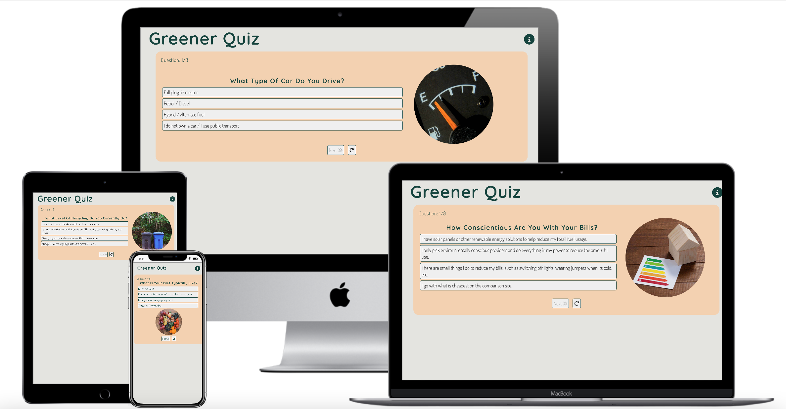

## 1. Design and Development

For the design of this quiz, the 5 pillars of User Experience Design (UXD) were used to cover the strategy, scope, structure, skeleton and surface to make sure the design is intuitive, simple and enjoyable. 

### 1.1 Strategy

The target user audience is for any adult / teenager to participate in the quiz, however wider scope could be considered.

Interviews and workshops with users and stakeholders were conducted to understand their requirements and perspectives for the quiz.

Research was conducted on similar quizzes to understand how they work; the type of questions and results asked; and most importantly how the user would feel moving through the quiz. The target user for each quiz was different for each quiz to give me a broad range on language and usability of each user.

### 1.2 Scope

From the research and interviews conducted with the target audience and stakeholders, user stories were created to determine the flow of the app. The focus was put on 5 user stories:
1. Start quiz
2. Navigation
3. Submit results
4. Share results
5. Restart quiz

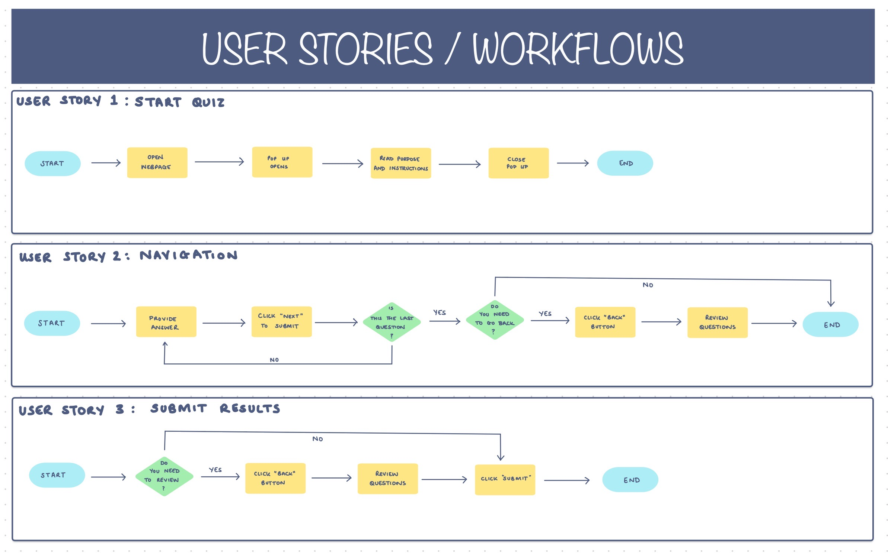
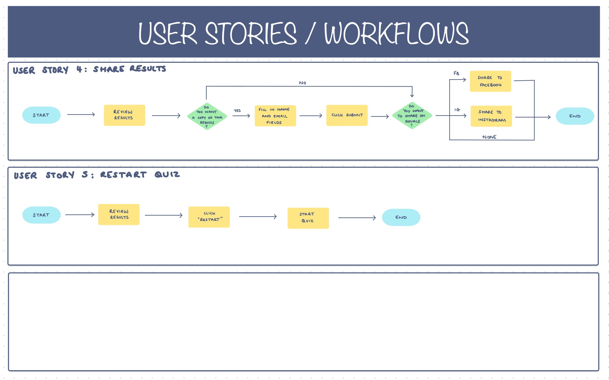

### 1.3 Structure

From the user stories, content, data, features and functionality can be determined. 

**For the content:**
- 1 HTML page: index.html
- 1 pop-up div for instructions
- 2 views:
  - Question div
  - Results div

**For the data:**
- Purpose and Instructions:
  - Purpose and instructional descriptions
  - Instructional images / videos
- Questions:
  - 15 questions
  - 4 answers
  - Complimentary imagary
- Results:
  - Score
  - Imagery

**For the features / functionality:**
- Progress bar or question counter
- Next and back buttons
- Restart quiz
- Form to retrieve email of results
- Share to social media

### 1.4 Skeleton

When the structure of the app, information and features had been determined, a wireframe for each view could be created:

**Question View:**

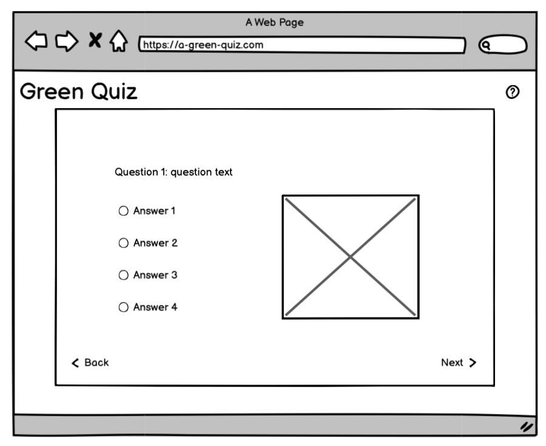

**Results View:**

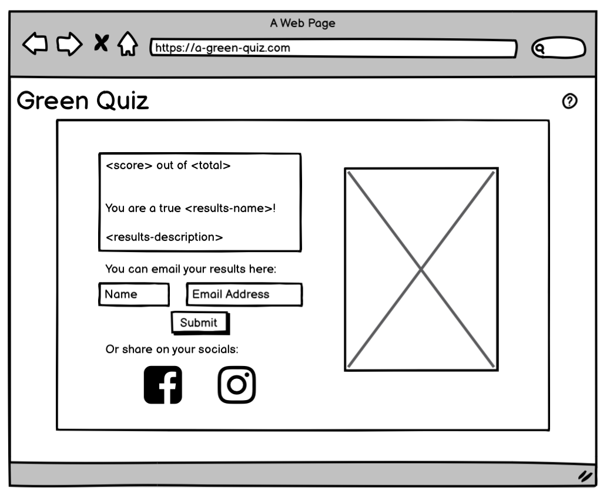

**Pop-up View:**

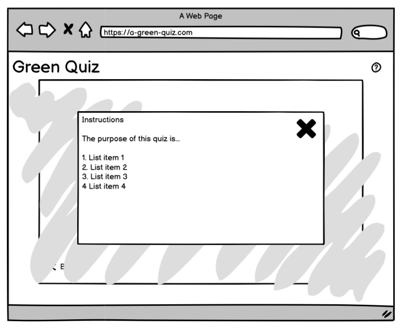

### 1.5 Surface

**Colour Palette**

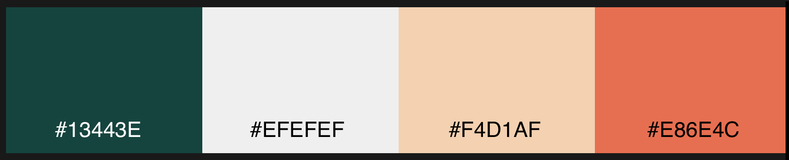

- The quiz's primary colours are (from left to right) #13443E, #EFEFEF, #F4D1AF and #E86E4C as seen in the picture above. They were derived using the online tool [colormind](http://colormind.io/), to make sure they complement and contrast. The colors are all nuances of green or orange, to mirror nature and enhance the connection with the being green.
- #13443E is used for headlines and text throughtout the quiz, unless a hyperlink, and as a border colour to emphasise buttons or sections of text. On hover and selection, all buttons turn the colour #13443E to show they are active. It is also used, in conjunction with an opacity of 0.5, as an overlay when the instructions pop-up is active. 
- #EFEFEF is used as the main background colour for the webpage, the instructions pop up and on buttons. On selection or hover on buttons, the text is changed to #EFEFEF to contrast with it's background.
- #F4D1AF is used as a contrasting background color for the question and results sections.
- #E86E4C is used minimally to highlight links away from the quiz. It is a brighter colour to contrast with the green.

**Typography**
- Quicksand is used for headings and header elements. The fallback font is sans serif.
- Dosis is used for all other text elements including paragraphs, button labels, lists, etc. The fallback font is sans serif.
- Both fonts are from Google Fonts.

## 2. Features 

### 2.1 Existing Features

The features deployed for this quiz are as follows:

- __Question Section__

  - The overall question section loads with the page. 
  - There is a total of 8 questions to answer, these are cycled through until the submit button is activated.
  - The content of this page includes a question counter, a question, four answers, an image and navigation buttons

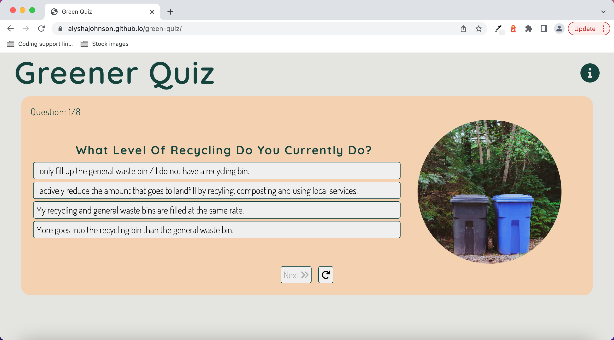

- __Question Counter__

  - The question counter provides the user with a counter which demonstrates how far along they are in the quiz.

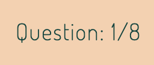

- __Answer Buttons__

  - There are four answers to chose from, but only one can be selected.
  - The hover pseudo class has been used on all buttons to show which button is being considered. On click, the answer you have selected is the active choice of the user as a result this activates the 'next' button to move forward in the quiz.

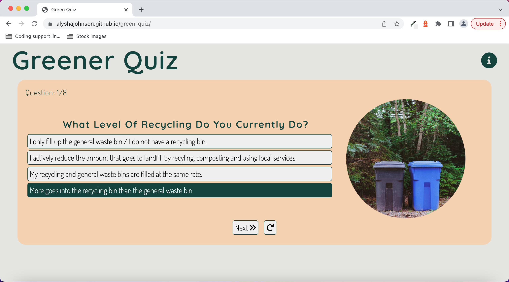

- __Navigation Buttons__

  - The 'next' buttons allows the user to move onto the next question once an answer has been selected.
  - If the user requires to change their selected answer, the 'reset' button can be used to unlock the selection and select another.

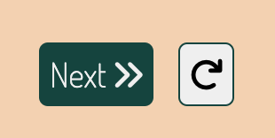

- __Help and Instructions__

  - Provides the purpose of the quiz
  - Cycles through 5 short videos introducing the user to the quiz, although there is a bug blocking this from happening.

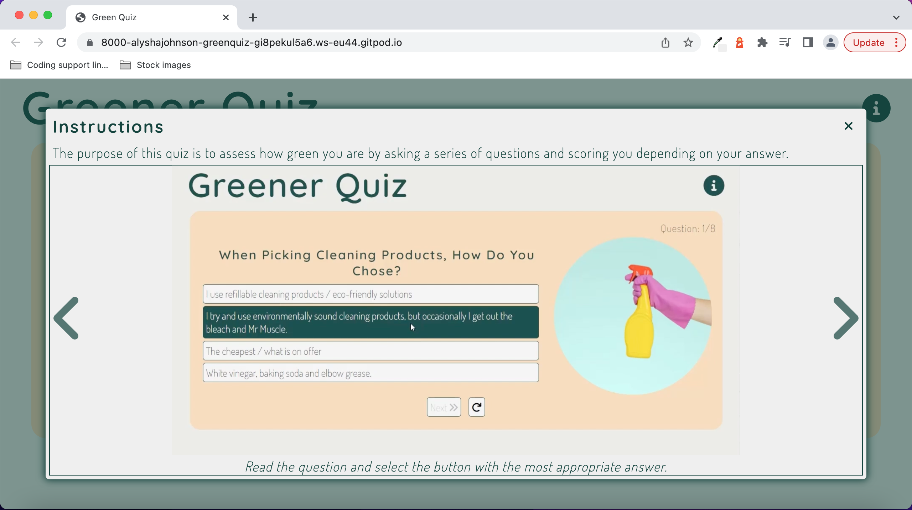

- __Results Page__ 

  - Tells the user the score, based off their interaction with the quiz.
  - Provides result description.
  - Links to an external blog to get insight into how to be more green.
  - Allows user to input name and email into form fields to get their results via email. 
  - Social media links.

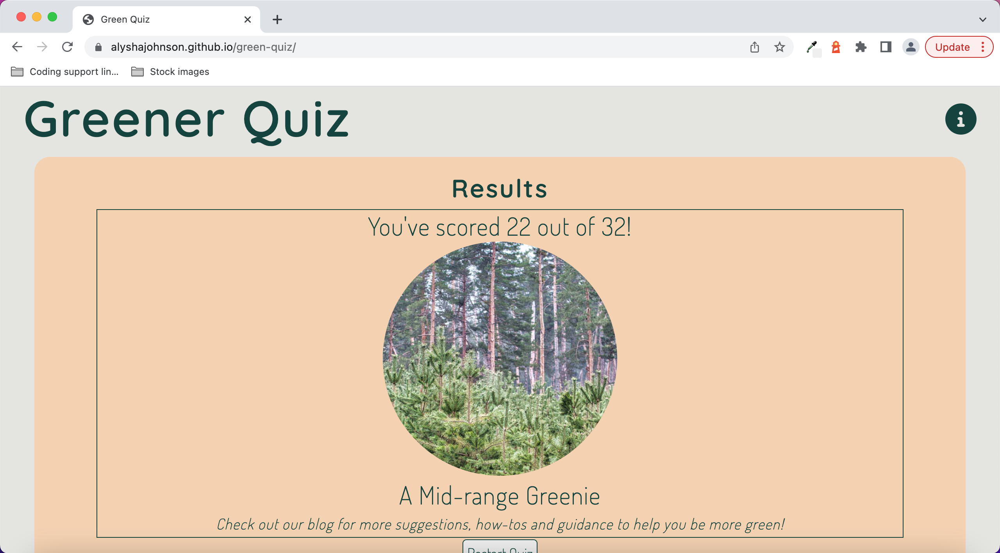

### 2.2 Future Features

In addition to the features deployed, some features that could be deployed in a future release are:
- On load, have the Instructions pop-up loaded.
- A back button feature to navigate back through the quiz
- Integrate the quiz into blog page (here)[https://alyshajohnson.github.io/Journey_to_green/]
- Randomising the answer array to produce a different sequence of the answers in each question
- Addition of a progress bar for instructions pop-up.
- More questions in the array

## 3. Testing 

### 3.1 Initial Developer Testing

Throughout project as developing quiz

The development of this app was conducted on Google Chrome, therefore extensive testing was conducted on this broswer. This was used as a benchmark against Firefox and Safari.

The elements of testing conducted on each browser are:
- User Experience - what does the quiz look like; is the flow through the quiz the same; are all elements where they are expected?
- Functionality - do the buttons work as expected; does the question counter count?
- Performance - how responsive is the site?
- Other - this includes spelling and grammatical errors.

The user experience is consistent on Chrome, Firefox and Safari. The instruction videos in Safari do not load - this bug has been captured.

Responsive design is important, CSS code had to be amended and adjusted to make sure the app could work on a number of devices. There were a number of user experience bugs that were produced when testing. These have now been fixed in the code.

### 3.2 Validator Testing 

Using tools such as W3C validator, Jigsaw and Lighthouse gives visibility of any code, scripts or elements that are causing any errors. The results for the site are as follows:

**HTML**
- No errors were returned when passing through the official [W3C validator](https://jigsaw.w3.org/css-validator/validator?uri=https%3A%2F%2Falyshajohnson.github.io%2Fgreen-quiz%2F&profile=css3svg&usermedium=all&warning=1&vextwarning=&lang=en)

**CSS**
- No errors were found when passing through the official [(Jigsaw) validator](https://jigsaw.w3.org/css-validator/validator?uri=https%3A%2F%2Falyshajohnson.github.io%2Fgreen-quiz%2F&profile=css3svg&usermedium=all&warning=1&vextwarning=&lang=en)

**Performance** 
- Results can be seen through the official [Lighthouse](https://googlechrome.github.io/lighthouse/viewer/?psiurl=https%3A%2F%2Falyshajohnson.github.io%2Fgreen-quiz%2F&strategy=mobile&category=performance&category=accessibility&category=best-practices&category=seo&category=pwa&utm_source=lh-chrome-ext) report.

As part of the performance test through Lighthouse, some changes were made:
- Accessibility (aria-label) tags were implemented on all buttons to improve the score from 82 to 100.
- The cache policy was amended to increase the length of number of seconds the browser should cache the resource.
- The image file sizes needed to be compressed so reduce the impact on performance. This was successfully done using [tinyPNG](https://tinypng.com/).

### 3.3 User Testing
This app has been tested by a small group of 10 users in which some feedback was captured in the design and some errors in functionality and spelling were corrected.

UI improvements made:
- Addition of icons on quiz navigation buttons.
- Order of buttons, suggested the reset and next buttons were the wrong way round. This change is now implemented.
- Remove hover pseudo class on next button when an answer has not been selected. This bug has been fixed.
- Text decoration and colour on links out of the quiz. These needed to be made more obvious to the user.

Errors / bug fixes:
- On question reset, the 'Next' button was still active. This bug has been fixed.
- Mobile device responsiveness on Instructions pop-up. This bug has been fixed.
- General spelling errors throughout quiz. These have been corrected.
- For better code readability, it was suggested to split out some code into more functions, for instance splitting out the updateProgreeCounter() function from the showNextQuestion() function. This has been corrected.
- To reduce amount of buttons and simplify code, the 'submit' button can be a label change on the 'next' button when the last question is reached rather than a change of button.
- As the JavaScript code for the Instructions pop-up did not interfere with the Quiz itself, it was suggested to split the code into two files: 'script.js' and 'instructions.js' to improve code readbility. This has been corrected.

### 3.4 Unfixed Bugs

- On the Instructions pop-up there is a bug preventing the user from cycling through the instructions and blocking the autorun() function. 
- To reduce amount of buttons and simplify code, the 'submit' button can be a label change on the 'next' button when the last question is reached rather than a change of button.

## 4. Deployment

The 'Green Quiz' was deployed to GitHub pages. The steps to deploy are as follows: 
  - In the GitHub repository, navigate to the Settings tab 
  - From the source section drop-down menu, select the Master Branch
  - Once the master branch has been selected, the page will be automatically refreshed with a detailed ribbon display to indicate the successful deployment. 

The live link can be found here - https://alyshajohnson.github.io/green-quiz/

## 5 Credits 

### 5.1 Content 

Logos and Fonts:
- The fonts were taken from [GoogleFonts](https://fonts.google.com/)
- The icons in the footer were taken from [Font Awesome](https://fontawesome.com/)

Tutorials and support:
- General guidance, information and limitations on elements, atrributes, and methods from [w3schools](https://www.w3schools.com/default.asp) and [MDN Web Docs](https://developer.mozilla.org/en-US/)
- Simple JavaScript quiz creation tutorial by Web Dev Simplified on [YouTube](https://www.youtube.com/watch?v=riDzcEQbX6k)
- How to make a Quiz App by Brian Design on[YouTube](https://www.youtube.com/watch?v=f4fB9Xg2JEY)
- Slideshow tutorial by Jay Watson on [YouTube](https://www.youtube.com/watch?v=_lquy7YDS7Y)
- Automatic slideshow by Code Addiction on [YouTube](https://www.youtube.com/watch?v=mngeB-2Cjqg)
- The many people who 'beta tested' the quiz app.

### 5.2 Media

The photos used throughout the quiz are stock imagery from the following services:
  - [unsplash](https://unsplash.com/)
  - [FreeImages](https://www.freeimages.com/)
  - [PikWizard](https://pikwizard.com/)

The videos as part of the help feature, were recorded and edited by the developer.

### 5.3 Research

As mentioned in the design section, competitor research was conducted. These are credited below:
- [ReduceReuseRecycle](https://www.reducereuserecycle.co.uk/greengames/how_green_are_you_fun_quiz.php)
- [BBC Newsround](https://www.bbc.co.uk/newsround/49793156)
- [ISL Collective](https://en.islcollective.com/english-esl-worksheets/vocabulary/environment/how-green-are-youquiz/76448)

### 5.4 Special Thanks
Along with those credited above, a special thanks goes to Akshat Garg who has mentored throughout this project and given advice on structure, content and functionality.